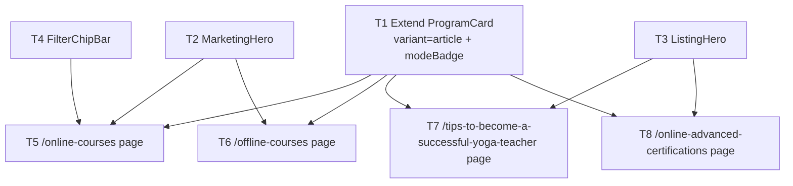

# Cross-Page Build Plan — Figma 1:1547, 1:4756, 1:7174, 1:2343

**Inputs**
- `_workspace/02_decomposition_cross_page.json` / `.md`
- `_workspace/02_codebase_scout_cross_page.json` / `.md`
- Shell pattern: `apps/web/src/app/page.tsx`, `apps/web/src/app/about/page.tsx`

**Output spec:** `_workspace/03_build_plan_cross_page.json`

---

## Strategy

The scout already collapsed most "new" components into existing files. The actual surface area is:

- **1 extension** — `ProgramCard` gains `variant='article'` + `modeBadge` (covers both the listing-page mode pill AND the editorial ArticleCard).
- **3 new files** — `MarketingHero`, `ListingHero`, `FilterChipBar`.
- **4 new pages** — one per Figma frame.

Everything else (`SiteHeader`, `SiteFooter`, `PopularCoursesSection`, `AccreditationsSection`, `WhyBodhiSection`, `ClosingCtaSection` for the Guided Path block, `TestimonialsSection`) is reuse-as-is. `ProgramsIntroSection` and `PopularCoursesSubGrid` from the decomposition both collapse into `PopularCoursesSection` invocations — no new section files.

Two waves, fully parallelizable inside each wave.

---

## Dependency graph



---

## Wave 1 — primitives & sections (parallel group 1)

All four can be dispatched simultaneously to four component-builder agents. No interdependencies.

| ID | Type | File | Why |
|----|------|------|-----|
| T1 | extend-component | `apps/web/src/components/ui/program-card.tsx` | Add `variant='article'` (kills ArticleCard duplication) + `modeBadge` floating pill. Existing call sites must remain unchanged. |
| T2 | new-section | `apps/web/src/components/sections/marketing-hero.tsx` | Bright image-band hero shared by `/online-courses` and `/offline-courses`. One component, two prop sets. |
| T3 | new-section | `apps/web/src/components/sections/listing-hero.tsx` | Dark-overlay hero shared by `/tips-...` and `/online-advanced-certifications`. Optional `eyebrow` / `breadcrumb` / `resultCount` / `headlineAccent` props handle both variants. |
| T4 | new-component | `apps/web/src/components/ui/filter-chip-bar.tsx` | Three rounded-pill tabs (All / Online / Offline). Controlled + uncontrolled. Pure presentational. |

---

## Wave 2 — page routes (parallel group 2)

All four pages can be dispatched simultaneously once Wave 1 is green. Each page is self-contained: it mounts `SiteHeader` + sections + `SiteFooter` directly, mirroring `apps/web/src/app/page.tsx`. No `layout.tsx` injection.

| ID | Type | File | Depends on |
|----|------|------|------------|
| T5 | new-page | `apps/web/src/app/online-courses/page.tsx` | T1, T2, T4 |
| T6 | new-page | `apps/web/src/app/offline-courses/page.tsx` | T1, T2 |
| T7 | new-page | `apps/web/src/app/tips-to-become-a-successful-yoga-teacher/page.tsx` | T1, T3 |
| T8 | new-page | `apps/web/src/app/online-advanced-certifications/page.tsx` | T1, T3 |

---

## Per-page composition

### T5 — `/online-courses` (Figma 1:1547)

```
SiteHeader
MarketingHero        eyebrow=Yoga Teacher Training, headline=Yoga Teacher Training Courses
FilterChipBar        tabs=[All, Online, Offline] (defaultIndex=0)
PopularCoursesSection  6 ProgramCards, all Online, modeBadge=Online
AccreditationsSection  8 logos, heading="Recognizing the Global Impact of Yoga"
WhyBodhiSection        default props
ClosingCtaSection      3 Guided Path cards (counsellor / assessment / 50-min session)
TestimonialsSection    Aanya / Lena / Ravi
SiteFooter
```

### T6 — `/offline-courses` (Figma 1:4756)

```
SiteHeader
MarketingHero          eyebrow=Yoga Teacher Training, headline="Become The Teacher You Were Meant To Be"
PopularCoursesSection  (acts as ProgramsIntroSection) eyebrow="Certification Yoga Courses", 5 featured cards mixed mode
PopularCoursesSection  (acts as PopularCoursesSubGrid) eyebrow="Top Popular Yoga Course", main 6 cards
AccreditationsSection
WhyBodhiSection
ClosingCtaSection
TestimonialsSection
SiteFooter
```

### T7 — `/tips-to-become-a-successful-yoga-teacher` (Figma 1:7174)

```
SiteHeader
ListingHero            eyebrow="23 courses", headline="Tips to become a", headlineAccent="successful yoga teacher"
                       (note: source typo "successfull" fixed to "successful" per decomposition)
<section>
  9 x ProgramCard variant="article", 4 with modeBadge=Online
</section>
SiteFooter
```

### T8 — `/online-advanced-certifications` (Figma 1:2343)

```
SiteHeader
ListingHero            breadcrumb="Home / Advanced Certifications / Online",
                       headline="Online Advanced Certifications", resultCount="23 courses"
<section>
  9 x ProgramCard variant="course" (default), all modeBadge=Online
</section>
SiteFooter             (mounted even though absent in Figma frame — per scout convention)
```

---

## Tradeoffs & decisions carried forward from scout

1. **ArticleCard collapses into ProgramCard.** Per scout warning, do NOT create `ui/article-card.tsx`. The variant prop on T1 covers it. This avoids drift the first time a designer updates card chrome.
2. **PopularCoursesSubGrid collapses into PopularCoursesSection.** Page T6 mounts PopularCoursesSection twice with different `courses[]` and eyebrows.
3. **ProgramsIntroSection collapses into PopularCoursesSection.** Same reasoning — no new section file.
4. **GuidedPathSection IS ClosingCtaSection.** Already mounted on `/` and `/about` with the three Guided Path cards. Just reuse on T5 and T6.
5. **Footer on `/online-advanced-certifications`.** Figma frame 1:2343 doesn't show one. Mount `SiteFooter` anyway per page-shell convention used by `/` and `/about`.
6. **Mint accent token.** ListingHero accent uses existing `text-brand-shade` (#8ee0ce). Defer adding `#3fffd5` until visual-qa flags the brighter mint as required.
7. **FilterChipBar labels.** "All / Online / Offline" inferred from context — confirm with design during QA.

---

## Per-task acceptance summary

All tasks share the global criteria (see `global_acceptance_criteria` in the JSON):

- Only existing tokens (`text-h1..h5`, `text-mini`, `text-subtext-*`, `text-body-*`, `text-text-*`, `bg-*`, `border-border-*`). No inline hex, no `clamp()`.
- TypeScript compiles (`yarn nx typecheck web`).
- Mobile (sm) stacks sections vertically without horizontal scroll at 375px viewport.
- Tablet (md) reflows 3-col grids to 2-col.
- Desktop uses `max-w-7xl` (1280) or `max-w-[1472px]` to match the Figma 1472 content gutter.

Per-task specifics (props, behavior, layout, tokens, acceptance bullets) live in `_workspace/03_build_plan_cross_page.json`.

---

## Visual-QA targets

The four production page routes themselves are the QA surfaces:
- `/online-courses`
- `/offline-courses`
- `/tips-to-become-a-successful-yoga-teacher`
- `/online-advanced-certifications`

Optional isolation routes (build only if visual-qa requests):
- `/demo/listing-hero` (both variants)
- `/demo/filter-chip-bar` (controlled + uncontrolled)
- `/demo/program-card-article` (variant + modeBadge)

---

## Open questions for the orchestrator

None blocking — all uncertainty has a chosen default with a fallback noted in `warnings_carried_forward`. Confirm with design during visual-qa pass:

1. FilterChipBar tab labels.
2. Whether to add a `--color-brand-mint` (#3fffd5) token for ListingHero accent.
3. Whether the 9-card grids on T7/T8 should be CMS-driven before merge (currently inline literals with TODOs).
