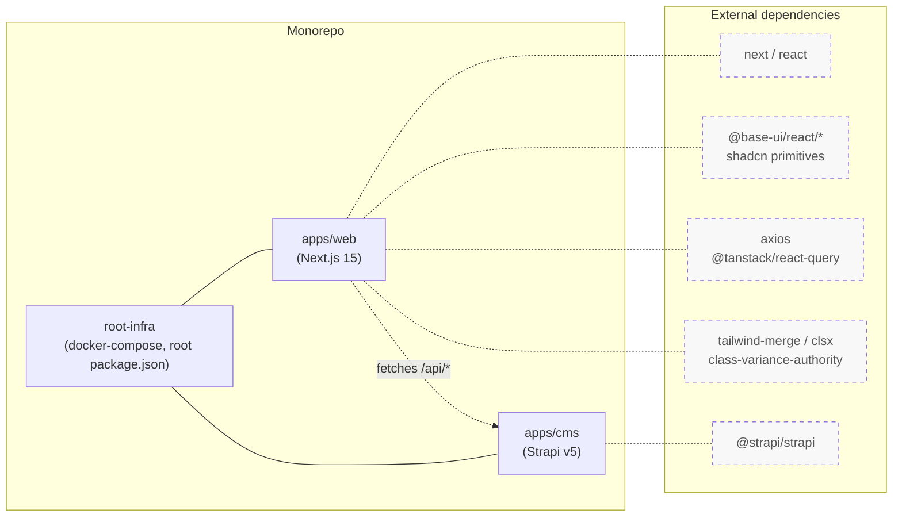
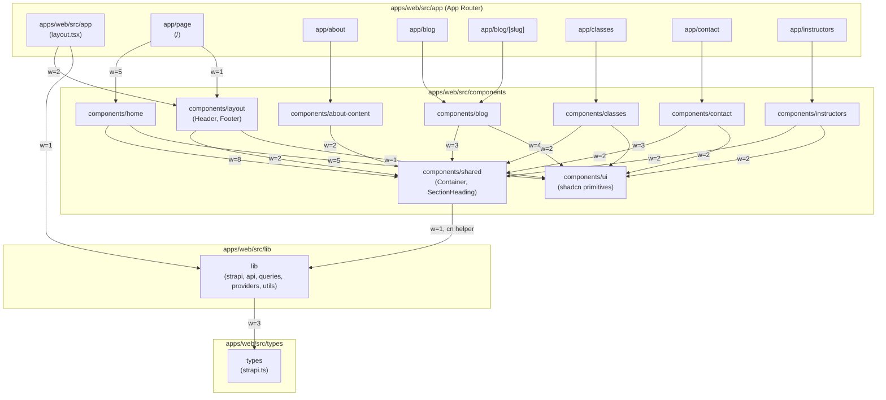
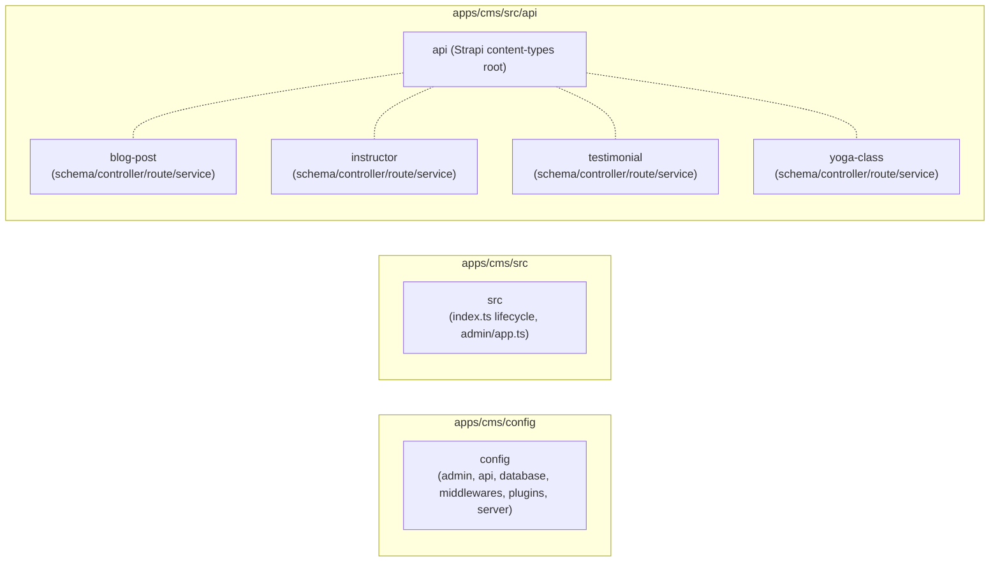
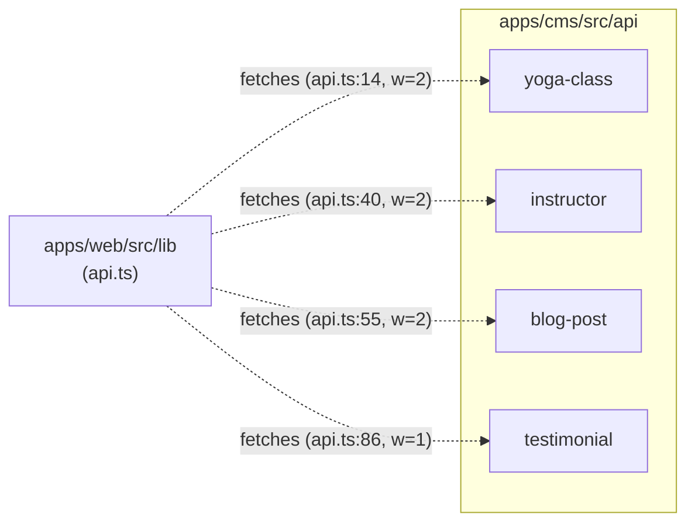

# Bodhi Codebase Graph

A two-app monorepo: a Next.js 15 yoga-studio marketing site (`apps/web`) and a Strapi v5 headless CMS (`apps/cms`) that feeds it.

## At a glance

| Metric | Value |
|---|---|
| Workspaces (L0) | 3 (`apps/web`, `apps/cms`, `root-infra`) |
| Total nodes | 31 (3 L0 + 12 L1 + 16 L2) |
| Total edges | 29 (25 `imports` + 4 `fetches`) |
| Cycles | 0 |
| External dependencies | 19 packages |
| Generated | 2026-05-21 |

Integrity check: every edge's `source` and `target` resolves to a node in `02_nodes.json`. No orphan edges; no inconsistencies file required.

---

## Workspace overview (L0)

The two apps are coupled only by HTTP — `apps/web/src/lib` calls Strapi's REST API. `root-infra` orchestrates both via docker-compose.

---

## apps/web internal structure

Pages are thin wrappers over feature components; feature components converge on `shared` (Container, SectionHeading) and `ui` (shadcn primitives); `lib` is the lone gateway to Strapi.

---

## apps/cms internal structure

The CMS side is import-flat: every controller/route/service is a one-liner using `factories.createCoreX`. There are no cross-content-type imports. The diagram exists to communicate the parallel structure across the four content types and to anchor where the web app's `fetches` arrows land.

The dotted lines inside `cms/src/api` are grouping (parent-child) rather than imports — they convey that the four content types are siblings under the same Strapi convention.

---

## Web → CMS boundary

Only `apps/web/src/lib` crosses the boundary. Four runtime HTTP calls, mediated by `fetchAPI` in `apps/web/src/lib/strapi.ts`.

---

## Narrative: how the codebase fits together

**Entry points.** The Next.js app boots from `apps/web/src/app/layout.tsx`, which wraps the tree in `Providers` (a `QueryClientProvider` from `apps/web/src/lib/providers.tsx`), mounts `Header` and `Footer` from `components/layout`, and loads Google fonts plus `globals.css`. Each route segment under `app/<route>/page.tsx` is a thin wrapper that delegates to a single feature component. The home route is the exception — `app/page.tsx` directly composes five sections from `components/home` plus the `Header`. Strapi boots from `apps/cms/src/index.ts`, whose `register`/`bootstrap`/`destroy` hooks are empty; all behaviour comes from `factories.createCoreX` defaults.

**Page-to-component composition.** Routing is the App Router; every page (`/about`, `/blog`, `/blog/[slug]`, `/classes`, `/contact`, `/instructors`) imports exactly one feature component (`<XContent />`) and renders it. This keeps the routing layer dumb and concentrates UI in `components/<feature>`. The blog post route (`app/blog/[slug]/page.tsx`) is slightly fatter because it also exports `generateMetadata` derived from the slug. The pattern is consistent enough that any new section can be added by creating a `components/<feature>/<feature>-content.tsx` pair plus a route file.

**The shared/ui design-system layer.** Two L2 component groups act as the project's design system: `components/shared` (Container, SectionHeading) and `components/ui` (shadcn primitives wrapping `@base-ui/react/*`). Every feature group imports from both — the strongest edges in the graph are `home → shared` (weight 8), `app/page → home` (5), and `home → ui` (5). Star topologies around `shared` and `ui` are exactly what you want: each feature is a sibling leaf converging on common primitives, with no horizontal coupling between features.

**The lib gateway pattern.** All Strapi access is concentrated in `apps/web/src/lib`. `strapi.ts` defines an axios instance and a typed `fetchAPI<T>` helper. `api.ts` exposes server-side fetchers (`getClasses`, `getInstructors`, `getBlogPosts`, `getTestimonials`) for Server Components and SSR; `queries.ts` builds React Query hooks on the same primitive for client-side use. `providers.tsx` exposes the `QueryClientProvider`. `utils.ts` is the `cn()` helper. The only cross-layer import is `components/shared/container.tsx → lib/utils.ts` for `cn` — a one-line dependency that does not create a cycle because nothing under `lib` imports back into `components`.

**The Strapi content-type symmetry.** `apps/cms/src/api` holds four content types — `blog-post`, `instructor`, `testimonial`, `yoga-class` — each with the standard schema/controller/route/service quartet. Every file in the controllers/routes/services tier is a one-liner delegating to `factories.createCoreX(...)`; the schema files are where the actual content models live. No content type imports from another; there is no shared util module on the CMS side. This makes the CMS side import-flat by design, and the web side's `lib/api.ts` is the only place that names all four endpoints together.

**Gap: blog components are still on mock data.** `apps/web/src/components/blog/blog-content.tsx` and `blog-post-content.tsx` use inline mock arrays rather than calling into `lib/api.ts` or `lib/queries.ts`. The graph reflects this: `components/blog` has no edges into `lib`, while every other feature consuming Strapi data does so via `lib`. The four `fetches` edges from `lib → cms/src/api/blog-post` exist, so the gateway is wired; the UI just hasn't been connected. This is the one notable inconsistency between the static structure and the data path.

---

## Strongest couplings

Top 10 edges by weight (all `imports` except where noted):

| # | Source | Target | Kind | Weight | Evidence |
|---|---|---|---|---|---|
| 1 | `apps/web/src/components/home` | `apps/web/src/components/shared` | imports | 8 | `components/home/hero.tsx:6` |
| 2 | `apps/web/src/app/page` | `apps/web/src/components/home` | imports | 5 | `app/page.tsx:1` |
| 3 | `apps/web/src/components/home` | `apps/web/src/components/ui` | imports | 5 | `components/home/cta.tsx:5` |
| 4 | `apps/web/src/components/blog` | `apps/web/src/components/ui` | imports | 4 | `components/blog/blog-content.tsx:6` |
| 5 | `apps/web/src/components/classes` | `apps/web/src/components/ui` | imports | 3 | `components/classes/classes-content.tsx:7` |
| 6 | `apps/web/src/components/blog` | `apps/web/src/components/shared` | imports | 3 | `components/blog/blog-content.tsx:9` |
| 7 | `apps/web/src/lib` | `apps/web/src/types` | imports | 3 | `lib/strapi.ts:2` |
| 8 | `apps/web/src/app` | `apps/web/src/components/layout` | imports | 2 | `app/layout.tsx:4` |
| 9 | `apps/web/src/components/about-content` | `apps/web/src/components/shared` | imports | 2 | `components/about-content.tsx:5` |
| 10 | `apps/web/src/lib` | `apps/cms/src/api/yoga-class` | fetches | 2 | `lib/api.ts:14` |

---

## External dependencies

Grouped by purpose:

**Framework**
- `next`, `next/font/google`, `next/link`, `next/image`
- `react`
- `@strapi/strapi`

**Data fetching**
- `axios`
- `@tanstack/react-query`

**UI primitives (shadcn / Base UI)**
- `@base-ui/react/navigation-menu`
- `@base-ui/react/merge-props`
- `@base-ui/react/use-render`
- `@base-ui/react/dialog`
- `@base-ui/react/separator`
- `@base-ui/react/button`
- `lucide-react`

**Styling**
- `class-variance-authority`
- `clsx`
- `tailwind-merge`

**Motion**
- `framer-motion`

---

## Known limitations and next steps

- `components/blog/*` uses inline mock arrays; wire it to `lib/api.ts` (`getBlogPosts`) and `lib/queries.ts` so the four `fetches` edges from `lib → cms/src/api/blog-post` actually reach UI.
- Controllers/routes/services on the CMS side are pure factory delegations. If any business logic gets added (auth checks, computed fields, lifecycle hooks), the L2 content-type nodes should be split into controller/service nodes.
- `components/about-content.tsx` is a loose top-level file rather than a feature folder. Either move it under `components/about/` for consistency or accept the exception explicitly.
- The graph treats type-only imports as `imports` edges; if compile-time vs runtime coupling matters later, split that into a separate edge kind.
- `components/shared → lib` is the one cross-layer edge (Container imports `cn`). Harmless today (no cycle), but worth watching if `lib` ever grows non-utility surface area.
